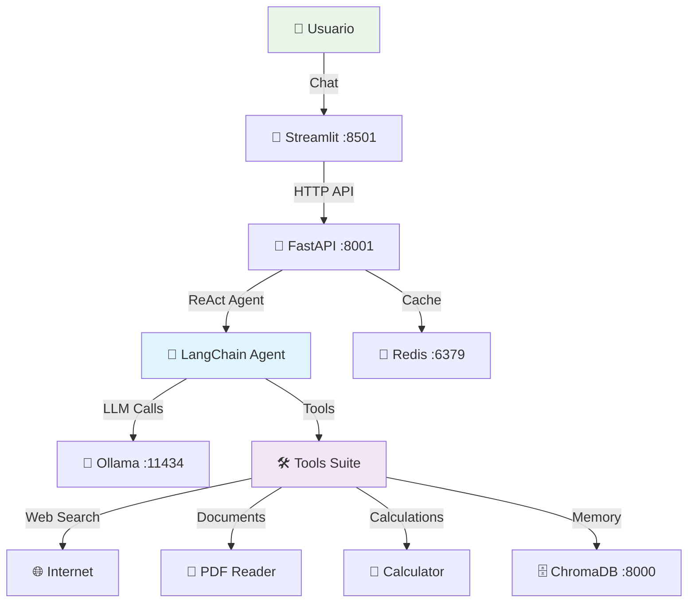

# SmartDoc Research Agent

> **Estado Actual: Base Funcional ✅ | Agente LangChain: En Desarrollo 🚧**

Agente de investigación inteligente powered by LangChain que puede investigar cualquier tema usando múltiples fuentes (web scraping, PDFs, cálculos), sintetizar información y generar reportes estructurados. Diseñado para funcionar completamente en local con Docker y aprovechar GPUs para modelos locales.

## 🎯 Objetivo del Proyecto

Desarrollar un **agente de IA autónomo** que pueda:

- 🔍 **Investigar temas complejos** usando múltiples fuentes de información
- 🌐 **Web scraping inteligente** para obtener datos actualizados
- 📄 **Procesar documentos PDF** subidos por el usuario
- 🧮 **Realizar cálculos** y análisis de datos
- 🧠 **Sintetizar información** de manera coherente usando LLMs locales
- 📊 **Generar reportes estructurados** en múltiples formatos
- 💭 **Mantener memoria** entre sesiones para investigaciones largas
- 🎨 **Interfaz intuitiva** para interactuar con el agente

## 📊 Estado Actual del Desarrollo

### ✅ COMPLETADO (v0.1 - Base Funcional)

#### 🏗️ Infraestructura
- [x] **Docker Compose** multi-servicio configurado
- [x] **FastAPI backend** (puerto 8001) con endpoints funcionales
- [x] **Streamlit frontend** (puerto 8501) con UI básica
- [x] **ChromaDB** (puerto 8000) para vectores y RAG
- [x] **Redis** (puerto 6379) para cache y sesiones
- [x] **Ollama** (puerto 11434) para LLMs locales
- [x] **Scripts de utilidad** (start-cpu.sh, start-gpu.sh, stop.sh)

#### 🔧 API Backend
- [x] **Endpoints funcionales**:
  - `GET /` - Info general
  - `GET /health` - Health check
  - `POST /research/session` - Crear sesión de investigación
  - `POST /research/chat/{session_id}` - Chat con agente
  - `GET /research/sessions` - Listar sesiones activas
  - `POST /upload/{session_id}` - Upload de archivos (placeholder)
- [x] **Sistema de sesiones** en memoria
- [x] **Modelos Pydantic** para validación
- [x] **CORS configurado** para Streamlit
- [x] **Logging** configurado
- [x] **Documentación automática** en `/docs`

#### 🎨 Frontend
- [x] **Streamlit UI** básica funcionando
- [x] **Chat interface** tipo ChatGPT
- [x] **Sidebar** con configuración y status
- [x] **Conexión API** verificada
- [x] **Research session** creation form

#### 🐳 DevOps
- [x] **Multi-environment** support (CPU/GPU modes)
- [x] **Environment variables** configuradas
- [x] **Health checks** en containers
- [x] **Volume persistence** para datos
- [x] **Network** configuration

### 🚧 EN DESARROLLO (v0.2 - Agente LangChain)

#### 🤖 Agent Core (Próximo)
- [ ] **LangChain Agent** con patrón ReAct
- [ ] **Conexión Ollama** para LLM real
- [ ] **Planning Module** para descomponer tareas
- [ ] **Tool Orchestrator** para decidir herramientas
- [ ] **Memory System** working/long-term memory
- [ ] **Validation Layer** para verificar resultados

#### 🛠️ Tools System
- [ ] **Web Search Tool** (requests + BeautifulSoup)
  - Búsqueda inteligente en internet
  - Rate limiting y respeto robots.txt
  - Extracción de contenido principal
- [ ] **PDF Reader Tool** 
  - Procesamiento de PDFs subidos
  - Búsqueda semántica en documentos
  - Extracción de texto estructurado
- [ ] **Calculator Tool**
  - Cálculos matemáticos complejos
  - Análisis estadístico con pandas
  - Visualizaciones con matplotlib
- [ ] **Code Executor Tool**
  - Ejecución segura de Python
  - Generación de gráficos
  - Análisis de datos
- [ ] **Memory Store Tool**  
  - ChromaDB integration
  - Semantic retrieval
  - Cross-session persistence
- [ ] **Report Generator Tool**
  - Templates personalizables
  - Múltiples formatos (MD, HTML, PDF)
  - Executive/Academic/Technical styles

### 🚀 ROADMAP (v0.3+ - Features Avanzadas)

#### 🧠 Advanced Agent Features
- [ ] **Multi-step reasoning** con chain-of-thought
- [ ] **Agent Inspector** para debugging del pensamiento
- [ ] **Multiple research styles** (Academic, Business, Technical)
- [ ] **Confidence scoring** y quality assessment
- [ ] **Batch processing** de múltiples queries
- [ ] **Research workflows** predefinidos

#### 🎨 UI/UX Enhancements  
- [ ] **Real-time streaming** de respuestas
- [ ] **Progress tracking** para investigaciones largas
- [ ] **Source visualization** con relevance scores
- [ ] **Document manager** para PDFs subidos
- [ ] **Report preview** y download
- [ ] **Agent reasoning** visualization

#### 📊 Analytics & Monitoring
- [ ] **Performance metrics** dashboard
- [ ] **Usage analytics** por usuario
- [ ] **Quality metrics** de investigaciones
- [ ] **Error monitoring** y alertas
- [ ] **Resource usage** tracking

## 🚀 Quick Start

### Prerequisites
- Docker & Docker Compose
- Ollama (para modelos locales)
- 8GB+ RAM recomendado
- GPU opcional (RTX 3060+ recomendado)

### Instalación

```bash
# 1. Clonar repositorio
git clone https://github.com/tu-usuario/smartdoc-research-agent.git
cd smartdoc-research-agent

# 2. Setup Ollama (si no está instalado)
./scripts/setup-ollama.sh

# 3. Iniciar servicios
# Para laptop/CPU:
./scripts/start-cpu.sh

# Para desktop/GPU:
./scripts/start-gpu.sh

# 4. Verificar servicios
./check_services.sh
```

### Acceso
- **🎨 UI**: http://localhost:8501
- **🚀 API**: http://localhost:8001  
- **📚 Docs**: http://localhost:8001/docs
- **🗄️ ChromaDB**: http://localhost:8000
- **🤖 Ollama**: http://localhost:11434

### Testing Rápido

```bash
# Health check
curl http://localhost:8001/health

# Crear sesión
curl -X POST http://localhost:8001/research/session \
  -H "Content-Type: application/json" \
  -d '{"topic": "inteligencia artificial", "objectives": ["aplicaciones actuales"]}'

# Chat básico (usa el session_id del paso anterior)
curl -X POST http://localhost:8001/research/chat/SESSION_ID \
  -H "Content-Type: application/json" \
  -d '{"message": "Hola, cuéntame sobre IA"}'
```

## 🏗️ Arquitectura



### Servicios

| Servicio | Puerto | Función | Estado |
|----------|--------|---------|--------|
| **Streamlit UI** | 8501 | Interfaz de usuario web | ✅ Funcional |
| **FastAPI API** | 8001 | Backend del agente + endpoints | ✅ Funcional |
| **Ollama** | 11434 | Motor de LLMs locales | ✅ Configurado |
| **ChromaDB** | 8000 | Base de datos vectorial | ✅ Configurado |
| **Redis** | 6379 | Cache y gestión de sesiones | ✅ Configurado |

## 🛠️ Desarrollo

### Environment Modes

```bash
# CPU Mode (laptop/desarrollo)
- Modelos ligeros (Llama 3.2 3B)
- Fallback a APIs externas
- Menor uso de recursos

# GPU Mode (desktop/producción)  
- Modelos más potentes (Llama 3.1 8B+)
- Procesamiento local completo
- Máximo rendimiento
```

### Estructura del Proyecto

```
smartdoc-api/
├── agent-api/              # FastAPI backend
│   ├── app/
│   │   ├── agents/         # 🚧 LangChain agents
│   │   ├── tools/          # 🚧 Agent tools
│   │   ├── memory/         # 🚧 Memory systems
│   │   ├── api/            # ✅ API routes
│   │   └── config/         # ✅ Settings
│   ├── Dockerfile          # ✅ Container config
│   └── requirements.txt    # ✅ Dependencies
├── streamlit-ui/           # ✅ Frontend
├── data/                   # ✅ Persistent volumes
├── scripts/                # ✅ Utility scripts
└── docker-compose.yml      # ✅ Multi-service config
```

### Scripts Disponibles

```bash
./scripts/start-cpu.sh      # Iniciar en modo CPU
./scripts/start-gpu.sh      # Iniciar en modo GPU  
./scripts/stop.sh           # Parar todos los servicios
./scripts/logs.sh           # Ver logs en tiempo real
./scripts/setup-ollama.sh   # Configurar modelos Ollama
./check_services.sh         # Verificar estado de servicios
```

### Logs y Debugging

```bash
# Ver logs específicos
docker logs smartdoc-agent-api -f
docker logs smartdoc-streamlit-ui -f

# Entrar a containers para debugging
docker exec -it smartdoc-agent-api bash

# Rebuild después de cambios
docker-compose build agent-api --no-cache
docker-compose up -d
```

## 🧪 Testing

### Endpoints Disponibles

```bash
# Health checks
curl http://localhost:8001/health
curl http://localhost:8501/_stcore/health

# API testing
curl http://localhost:8001/docs  # OpenAPI docs
curl http://localhost:8001/research/sessions

# Ollama testing
curl http://localhost:11434/api/version
ollama list  # Ver modelos instalados
```

### UI Testing

1. **Abrir** http://localhost:8501
2. **Verificar** sidebar muestra "✅ API Connected"  
3. **Crear** research session con un topic
4. **Chatear** con el agente básico
5. **Verificar** que guarda conversación

## 🚨 Troubleshooting

### Problemas Comunes

**Puerto 8001 no responde:**
```bash
docker logs smartdoc-agent-api
# Verificar errores de Python/imports
```

**Ollama no conecta:**
```bash
curl http://localhost:11434/api/version
ollama list
# Verificar modelos descargados
```

**Container no arranca:**
```bash
docker-compose ps
docker-compose down && docker-compose up -d
```

**Performance issues:**
```bash
# Verificar recursos
docker stats
# Cambiar a modelos más ligeros en .env
```

## 🤝 Contribuir

### Próximas Prioridades

1. **LangChain Agent Core** - Implementar agente ReAct real
2. **Web Search Tool** - Primera herramienta funcional  
3. **Ollama Integration** - Respuestas reales del LLM
4. **Memory System** - ChromaDB para persistencia
5. **PDF Processing** - Subida y análisis de documentos

### Development Workflow

1. **Fork** el repositorio
2. **Crear** branch para feature: `git checkout -b feature/web-search-tool`
3. **Desarrollar** con testing continuo
4. **Probar** con `./check_services.sh`
5. **Commit** con mensajes descriptivos
6. **PR** con descripción detallada

## 📄 Licencia

MIT License - Ver [LICENSE](LICENSE) para detalles.

## 🙏 Acknowledgments

- **LangChain** - Framework de agentes
- **Ollama** - LLM local inference
- **FastAPI** - Backend framework
- **Streamlit** - Frontend framework
- **ChromaDB** - Vector database

---

**Estado**: Base funcional completada ✅ | Próximo: Agent LangChain 🚧

**Versión**: 0.1.0 | **Último update**: Enero 2025